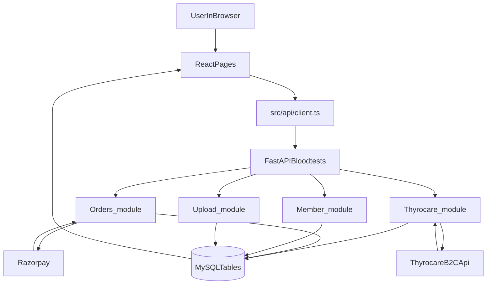

# Nucleotide App ↔ Bloodtests Backend (Thyrocare) — End-to-End Working (Concise)

This file is the “read once and understand everything important” view of:
- **Frontend**: where integrations happen and what the UI expects.
- **Backend (Bloodtests)**: how orders, Razorpay, Thyrocare booking/webhooks, report extraction, and member switching work internally.

## Architecture (one picture)



## 1) Frontend: how API calls/auth work

### One API client for everything
- **File**: `src/api/client.ts`
- **Requests always**:
  - `credentials: 'include'` (cookies enabled)
  - `Authorization: Bearer <token>` when available
  - `X-CSRF-Token: <csrf>` when available
- **401 behavior**:
  - automatically calls `POST /auth/refresh`
  - stores new token/CSRF if returned
  - retries the original request once

### Where the UI pulls “reports” and “PDF”
- **Reports list**: `src/pages/ReportsListPage.tsx` via `fetchMyReports()` in `src/api/orders.ts`
  - `GET /thyrocare/reports/my-reports` (primary)
  - merges `GET /upload/reports/my-reports` (external uploads; best-effort)
  - uses `GET /orders/list` + `GET /thyrocare/orders/my-orders` to enrich with order badges / map booking ids → our order ids
- **Report detail**: `src/pages/ReportPage.tsx`
  - turns `results[]` (or similar arrays) into biomarker cards
  - download logic:
    1) use any embedded URL fields on the report row
    2) else `GET /thyrocare/reports/{patient_id}/download`
    3) else `GET /thyrocare/orders/{thyrocare_order_id}/reports/{lead_id}?type=pdf`
    4) else blob-download fallback (`api.getBlob`)

## 2) Backend: member switching (what changes when you switch profile)

### Token carries `selected_member_id`
- **File**: `Bloodtests/Member_module/Member_router.py`
- `POST /member/select/{member_id}`:
  - validates member belongs to user
  - decodes current token → reads `session_id` / `device_platform`
  - issues **new JWT** embedding `selected_member_id`
  - for web, also updates HttpOnly `access_token` cookie
- `GET /member/current`:
  - uses `get_current_member` (reads token)
  - if none selected: falls back to `self` profile or oldest member

### Member API key header convention
`Member_router.py` declares a standard header:
- `X-Member-Api-Key` (frontend should read `api_key` from `/member/current`)

This is a per-member key used when endpoints need explicit member association (some modules may rely on JWT `selected_member_id`, others on this header).

## 3) Backend: orders + Razorpay (source of truth is webhook)

### Create order (frontend initiates)
- **Backend file**: `Bloodtests/Orders_module/Order_router.py`
- `POST /orders/create`:
  - reads all active cart items for the user
  - **blood tests require appointment set per group**; otherwise returns 422 with groups missing slot
  - creates Razorpay order and persists payment/init state (Order/Payment or PendingCheckout depending on path)

### Verify payment (frontend) vs confirm payment (webhook)
- `POST /orders/verify`:
  - gives immediate feedback, but **does not finalize confirmation**
  - sets status to PROCESSING / “waiting for webhook”

- `POST /orders/webhook` (Razorpay webhook):
  - verifies signature
  - inserts `WebhookLog`
  - updates/creates `Payment` + transitions
  - sets `Order.payment_status = COMPLETED` and `Order.order_status = CONFIRMED` (idempotent)
  - then calls Thyrocare booking **non-blocking**:
    - `from Thyrocare_module.thyrocare_booking_service import book_thyrocare_for_order`

## 4) Thyrocare calling: exact API endpoints + auth

### Service + auth token reuse
- **File**: `Bloodtests/Thyrocare_module/thyrocare_service.py`
- Auth:
  - `POST {THYROCARE_BASE_URL}/partners/v1/auth/login` → stores bearer token + expiry
  - token auto-refresh when near expiry
- Vendor calls used by backend include:
  - `POST /partners/v1/orders` (book home-collection)
  - `POST /partners/v1/slots/search`
  - `GET /partners/v1/orders/{orderId}?include=tracking,items,price`
  - `GET /partners/v1/orders/{orderId}/status`
  - `GET /partners/v1/.../reports/{leadId}?type=pdf`
  - catalogue + serviceability endpoints

## 5) Multi-member / multi-product “shape”: how many Thyrocare order IDs you get

This is the core rule you asked for (CBC + Lipid + 2 members etc.).

### Booking groups = “visits”
- **File**: `Bloodtests/Thyrocare_module/thyrocare_booking_service.py`
- The backend first buckets blood-test `OrderItem`s by a visit key:
  - `(address_id, appointment_date, appointment_start_time)` (from OrderSnapshot)

### Splitting rule (important)
Within one visit bucket:
- If **exactly 1 unique member_id** in that visit: **keep all products together** → **1 Thyrocare order** containing multiple items.
- If **>1 unique member_id** in that visit: **split per product** → **1 Thyrocare order per product**.
- If any `member_id` is missing: also split per product (safety to avoid wrong merges).

#### Example: 2 members × 2 products, same address+slot
- CBC for A + B, Lipid for A + B
- Visit has >1 member → split per product:
  - ThyrocareOrderId_1: CBC with patients [A,B]
  - ThyrocareOrderId_2: Lipid with patients [A,B]

#### Example: 1 member × 2 products, same address+slot
- Visit has 1 member → 1 Thyrocare order with items [CBC,Lipid] for that single patient.

## 6) The actual Thyrocare booking JSON we send (canonical skeleton)

Generated in `_book_group()` in `thyrocare_booking_service.py` and sent to:
`POST {THYROCARE_BASE_URL}/partners/v1/orders`

Key points:
- Each patient includes `attributes.externalPatientId = str(member.id)` (this powers correct mapping in webhooks).
- `attributes.refOrderNo = "{order.order_number}_{bucketIndex}"` (your internal visit ref).

```json
{
  "address": {
    "houseNo": "label",
    "street": "street_address",
    "addressLine1": "label street landmark city",
    "addressLine2": "landmark",
    "landmark": "landmark",
    "city": "city",
    "state": "state",
    "country": "country",
    "pincode": 560001
  },
  "email": "user@email",
  "contactNumber": "+91-xxxxxxxxxx",
  "appointment": { "date": "YYYY-MM-DD", "startTime": "09:00", "timeZone": "IST" },
  "origin": { "platform": "web", "appId": "nucleotide-app", "portalType": "b2c", "enteredBy": "Name", "source": "Nucleotide" },
  "paymentDetails": { "payType": "POSTPAID" },
  "attributes": {
    "isReportHardCopyRequired": false,
    "refOrderNo": "ORD-2026-000123_1",
    "collectionType": "HOME_COLLECTION"
  },
  "patients": [
    {
      "name": "MemberName",
      "gender": "MALE",
      "age": 32,
      "ageType": "YEAR",
      "contactNumber": "+91-xxxxxxxxxx",
      "email": "member@email",
      "attributes": {
        "patientAddress": "street, city",
        "externalPatientId": "218"
      },
      "items": [
        { "id": "TC_PRODUCT_CODE", "type": "SSKU|MSKU|OFFER", "name": "CBC", "origin": { "platform": "web" } }
      ],
      "documents": []
    }
  ]
}
```

### What DB fields are updated immediately after booking
- **File**: `Bloodtests/Orders_module/Order_model.py`
  - `OrderItem.thyrocare_order_id` set to vendor order id
  - `OrderItem.thyrocare_booking_status = "BOOKED"` (or FAILED + error)
  - `Order.thyrocare_order_id` set (first id; items hold full per-visit set)
  - `Order.thyrocare_booking_status = "BOOKED"` if not failed

Also seeds tracking for UI status immediately:
- **File**: `Bloodtests/Thyrocare_module/thyrocare_webhook_model.py`
  - Upserts `thyrocare_order_tracking` with:
    - `current_order_status = "YET TO ASSIGN"` (initial milestone)
    - `member_ids` + `order_item_ids` + `ref_order_no`

## 7) Thyrocare webhook: what arrives, which fields update what, and how member mapping works

### Endpoint
- **File**: `Bloodtests/Thyrocare_module/Thyrocare_router.py`
- `POST /thyrocare/webhook`

### Payload normalization
Webhook can be nested (`orderData`) or flat; backend merges root fields into `orderData` when missing:
- `patients`, `phlebo`, `appointmentDate`, `lastUpdatedTimestamp`, `orderId`, `status`, `orderStatusDescription`, `b2cPatientId`

### Tracking tables updated

The webhook primarily maintains **three tables** (see `Bloodtests/Thyrocare_module/thyrocare_webhook_model.py`):

- **`thyrocare_order_tracking`** (`ThyrocareOrderTracking`)
  - `thyrocare_order_id` (unique)
  - `our_order_id` (internal order id, best-effort)
  - `user_id`
  - `member_ids` (JSON list, set at booking time; merged on later webhooks)
  - `order_item_ids` (JSON list, authoritative mapping of which internal items belong to this booking)
  - `current_order_status` and `current_status_description`
  - `phlebo_name`, `phlebo_contact`, `appointment_date`
  - `last_webhook_at`

- **`thyrocare_order_status_history`** (`ThyrocareOrderStatusHistory`)
  - one row per distinct `(order_status, order_status_description)` for a tracking row
  - stores `raw_payload` (JSON) + `thyrocare_timestamp` + `received_at`
  - repeat webhooks update timestamps/payload instead of creating duplicates

- **`thyrocare_patient_tracking`** (`ThyrocarePatientTracking`)
  - one row per **SP*** patient id per order
  - stores per-patient report availability and where the PDF is:
    - `is_report_available`, `report_url`
    - optional `report_pdf_s3_key` / `report_pdf_s3_url`
  - stores mapping back to our system:
    - `member_id`, `user_id`

### How the webhook maps a Thyrocare patient to your member
Inside `POST /thyrocare/webhook` the backend resolves `member_id` for each `patients[]` entry:

1) **Preferred**: `externalPatientId` (can be present in patient `attributes` or item `attributes`)\n
   - must be numeric\n
   - must match a member that belongs to the *same booking group* (`order_item_ids` / order items for this thyrocare_order_id)\n
   - if invalid/unmatched: backend **does not** fall back to name/index (prevents wrong mapping)

2) If `externalPatientId` absent:\n
   - name match only when **unambiguous**\n
   - if booking has 1 member only, it can map by that single member\n
   - for multi-member orders: it refuses “index fallback” (warns in logs)

This design is why the booking payload’s `attributes.externalPatientId = member.id` is critical.

## 8) When does “Report Ready” happen and why the UI shows the report for the correct members

There are **two parallel signals** in the system:

### A) Vendor tracking status (timeline / stepper)
- Source: `thyrocare_order_tracking.current_order_status` (webhook updates it)
- Mapping used by backend: `_THYROCARE_STATUS_INFO` in `Bloodtests/Thyrocare_module/Thyrocare_router.py`
  - `YET TO ASSIGN|ASSIGNED|ACCEPTED|...` → **Order Placed**
  - `SERVICED` → **Sample Collected**
  - `SAMPLE IMPORTED` → **Lab Received**
  - `DONE|REPORTED` → **Report Ready** (vendor indicates results exist)
  - `CANCELLED` → **Cancelled**

### B) Structured results rows (parameter cards)
The UI’s parameter cards require `results[]` shaped lines. For Thyrocare blood tests these come from:
- **Table**: `ThyrocareLabResult` (see inserts in `Thyrocare_router.py`)
- Populated by background extraction triggered from webhook processing:\n
  - when report becomes available, backend fetches XML/lines and stores one row per parameter

So in a **CBC+Lipid with 2 members** case:
- Booking splits into **2 Thyrocare orders** (per product) when both members are on the visit.
- Webhook receives patient lines (SP* ids) and maps each patient back to the right `member_id` using `externalPatientId`.
- When lab results are extracted, they are stored with `member_id`, so `GET /thyrocare/reports/my-reports` returns `member_id → results[]`.
- Frontend “Uploaded/Nucleotide” tabs filter on `source` and render the correct member names from `member_id`.

## 9) Backend endpoints that feed the frontend screens

### Thyrocare reports list
- **Backend**: `GET /thyrocare/reports/my-reports` in `Bloodtests/Thyrocare_module/Thyrocare_router.py`
- Query: loads `ThyrocareLabResult` filtered by `user_id`, optional `member_id`.
- Response shape is grouped:
  - `data: [{ member_id, results: [ { thyrocare_order_id, patient_id, test_code, description, test_value, normal_val, units, indicator, report_group, sample_date, category } ] }]`

This is why the frontend has normalization code in `src/api/orders.ts` to “lift” keys from nested `results[]` for list display and routing.

### Thyrocare PDF download for one patient
- **Backend**: `GET /thyrocare/reports/{patient_id}/download`
- Logic (in `Thyrocare_router.py`):
  - checks `thyrocare_patient_tracking` for that SP* patient id
  - if a stored S3 key exists → returns a presigned S3 URL (302 redirect)
  - else if only a raw report URL exists and it’s expired → re-fetches from Thyrocare via `ThyrocareService.get_report()`

### Thyrocare order details (combined view)
- **Backend**: `GET /thyrocare/orders/{thyrocare_order_id}/order-details`
- Combines:
  - order tracking
  - status history
  - patient tracking
  - payment info (via `Orders_module.Payment`)

### Orders status pipeline (non-vendor internal status)
- **Backend**: `PUT /orders/{order_number}/status`
- Doc: `Bloodtests/UPDATE_ORDER_STATUS_SAMPLE_COLLECTED_TO_REPORT_READY.md`
- Supports updating either:\n
  - whole order, or\n
  - one `order_item_id`, or\n
  - all items for an `address_id`

This is used to move internal statuses (scheduled → collected → report_ready) and is separate from Thyrocare webhook status tracking.

## 10) Differences: blood-test vs genetic-test integration

- **Blood tests (Thyrocare)**
  - booking + status is vendor-driven\n
  - webhook updates `thyrocare_*` tracking tables\n
  - structured lab parameters come from `ThyrocareLabResult` extraction\n
  - UI “timeline” comes from mapping vendor statuses + status history

- **Genetic tests / other products**
  - primarily use internal `orders` + `order_items` statuses\n
  - internal status updates can be driven via `PUT /orders/{order_number}/status`\n
  - no Thyrocare webhook required for report readiness

## 11) External uploads (parallel path)

- **Backend**: `Bloodtests/Upload_module/Upload_router.py`\n
  - stores uploaded file\n
  - if PDF: extracts lines and stores `uploaded_lab_results` with `member_id`\n
  - returns My-Reports compatible rows from `GET /upload/reports/my-reports`
- **Frontend**: merges uploaded rows into “My Reports” and renders using the same cards logic.

